# Machine Learning Operations

* [Overview](#overview)
* [Architectural Diagram](#architectural-diagram)
* [Key Steps](#key-steps)
* [Screen Recording](#screen-recording)
* [Future Improvements](#future-improvements)

## Overview
The main objective of this project ist to use Microsoft Azure to configure a cloud-based machine learning production model, before deploying and consuming it. This also includes creating, publishing and consuming a pipeline.

The data for this project is related to direct marketing campaigns of a Portuguese banking institution. The marketing campaigns were based on phone calls. Often, more than one contact to the same client was required, in order to access if the product (bank term deposit) would be ('yes') or not ('no') subscribed. The classification goal is to predict if the client will subscribe (yes/no) a term deposit (variable y). [Here is the link to the dataset](https://archive.ics.uci.edu/ml/datasets/bank+marketing).

As a general overview, a lot of algorithms were trained in order to solve a classification problem using the AutoML functionality of AzureML. Based on all trained models, the best model was then deployed to a REST endpoint that can be consumed by other applications. In step '6. Consume model endpoints' (see below), one can see what response the REST endpoint returned when it was consumed by an application (in this case, the 'endpoint.py' script on a local device). As a second step, a pipeline on AzureML was created using Azure SDK for Python in order to automate the general model training process. By deploying the model training process pipeline itself to a REST endpoint, the REST pipeline can then be kicked-off with a simple REST API call using the HTTP POST method.

This project focuses on the operationalising of the machine learning model, rather than improving it.

## Architectural Diagram
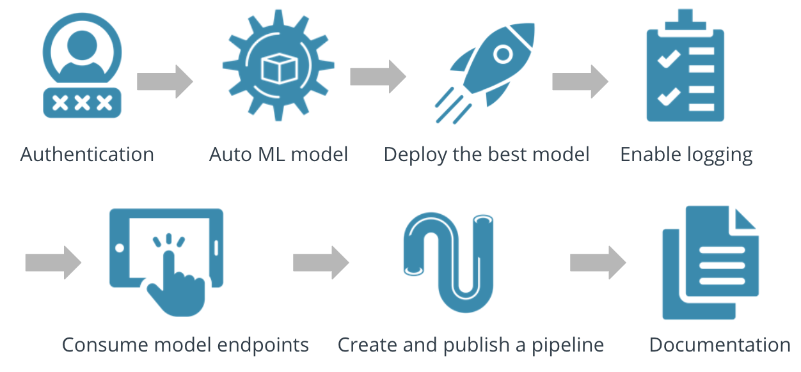

The project's main steps are the following:
1. Authentication
2. Automated ML experiment
3. Deploy the best model
4. Enable logging
5. Swagger documentation
6. Consume model endpoints
7. Create and publish a pipeline
8. Documentation

## Key Steps
### 1. Authentication
The Azure command-line interface (Azure CLI) is a set of commands used to create and manage Azure resources. In this step, a service principal is created, using the AzureML Command Module as an extension. A service principal is an identity created for use with applications, hosted services, and automated tools to access Azure resources. This access is restricted by the roles assigned to the service principal, giving you control over which resources can be accessed and at which level. For security reasons, it's always recommended to use service principals with automated tools rather than allowing them to log in with a user identity.

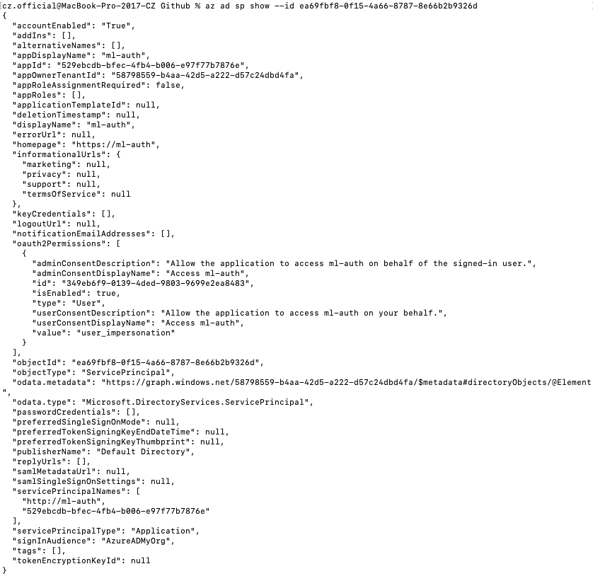\
The command 'az ad sp show' shows the details of the service principal.

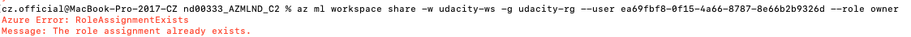\
The command 'az ml workspace share' shares a workspace with another user with a given role. In this case, the role assignment already exists.

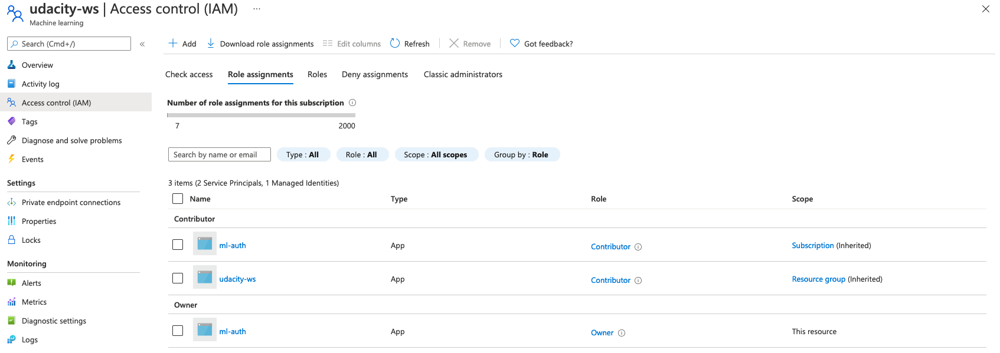\
Once, the service principal (ea69...) is successfully created and shared with the workspace (udacity-ws), the owner (ml-auth) can be seen in the Azure Portal as well. Access control (IAM) is the page that you typically use to assign roles to grant access to Azure resources. It's also known as identity and access management (IAM).

### 2. Automated ML experiment
As security is enabled and authentication is completed, the next step is to upload the bankmarketing dataset, create an experiment using AutoML, configure a compute cluster and use that cluster to run the classification experiment.

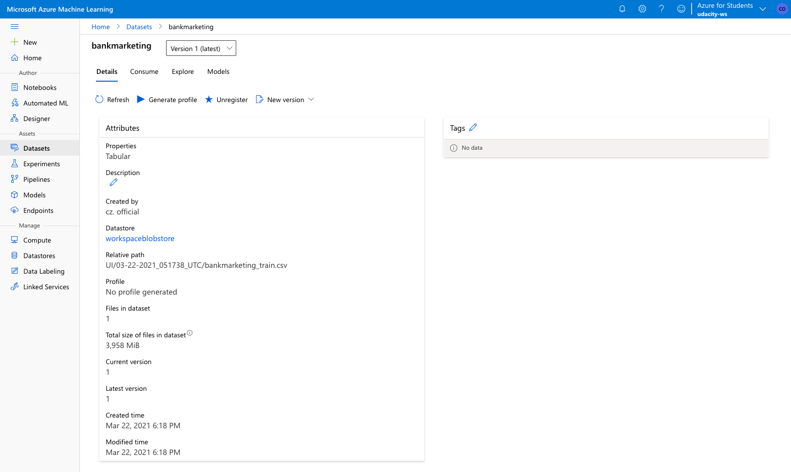\
This screenshot shows the registered dataset in ML Studio. Background information about the dataset can be found in the overview section.

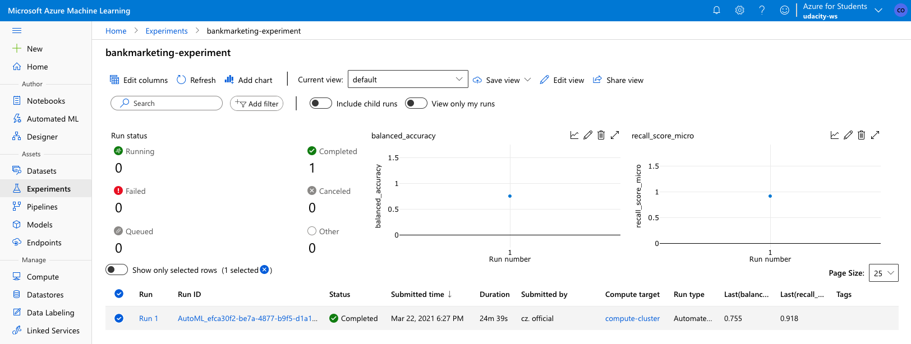\
The 'bankmarketing-experiment' is completed. The AutoML run took approximately 25 minutes to complete.

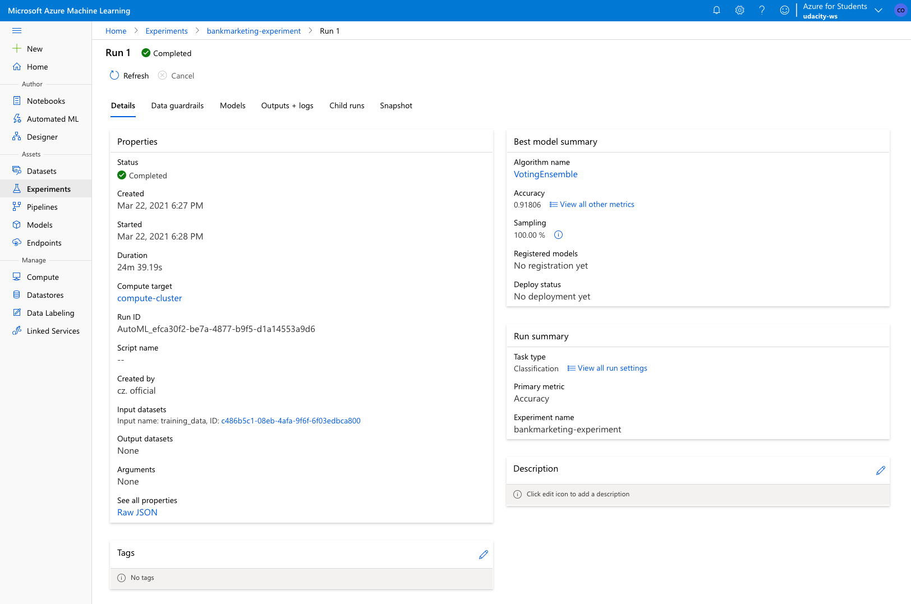\
The best model that was derived by AutoML was a VotingEnsemble algorithm with an accuracy of almost 92%. Ensemble modeling is a process where multiple diverse models are created with the aim to aggregate the predictions of each base model, resulting in one final prediction for the unseen data that is usually more accurate than the each one returned by each single model. Basically, ensembling strategies reduce the generalization error of the prediction. Two types can be differentiated:
- Voting: soft-voting which uses weighted averages (as used in this project).
- Stacking: two layers are used, where the first layer has the same models as the voting ensemble, and the second layer model is used to find the optimal combination of the models from the first layer (performed worse in this project).

### 3. Deploy the best model
After completing the experiment, the best model (in this case the VotingEnsemble model) can be deployed. Deploying this model will allow us to interact with the HTTP API service and interact with the model by sending data over POST requests. The deployment of the model is done in AzureML Studio by enabeling key-based authentication using Azure Container Instances (ACI).

### 4. Enable logging
Now that the best model is deployed, Application Insights can be enabled to retrieve logs. Application Insights is used to monitor live applications. It will automatically detect performance anomalies, and includes powerful analytics tools to help diagnose any performance and usability issues.

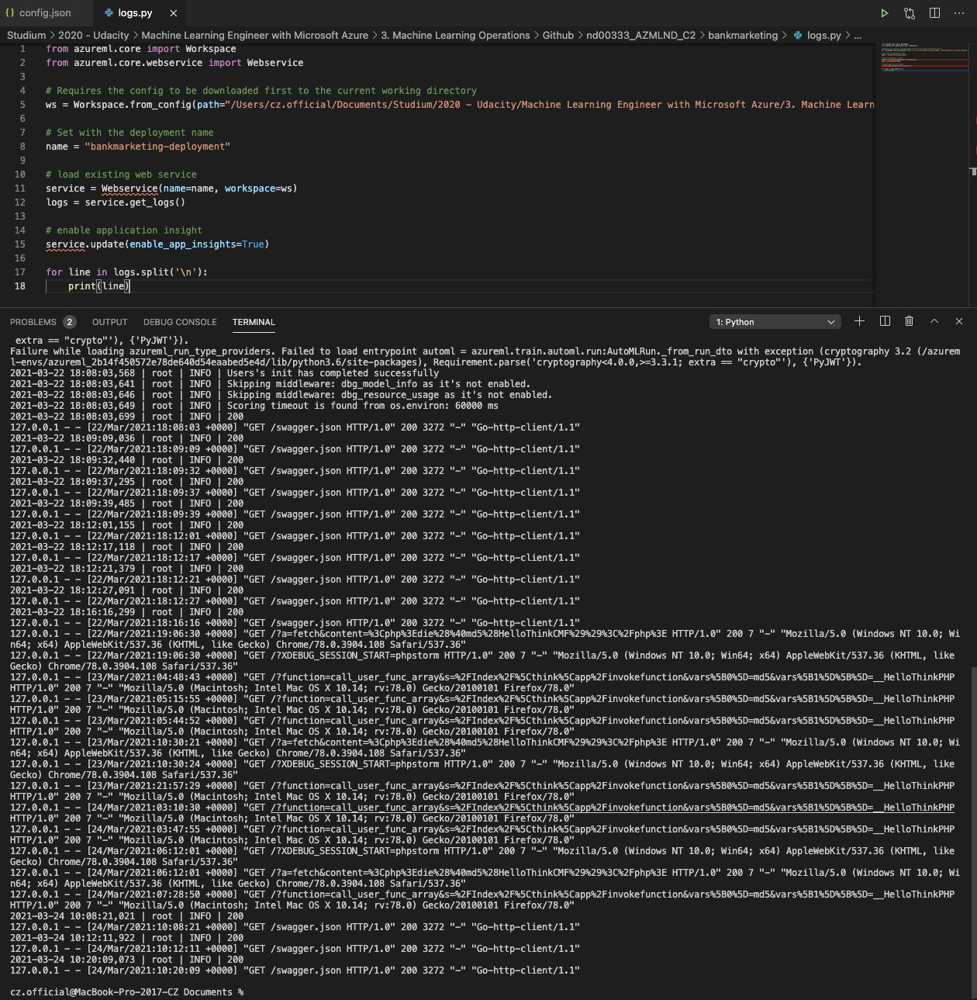\
One way of enabling Application Insights is using the Azure command-line interface (Azure CLI). In this case, code line 15 enables Application Insights by updating the loaded Webservice ('enable_app_insights=True'). This refers also to the uploaded logs.py script.

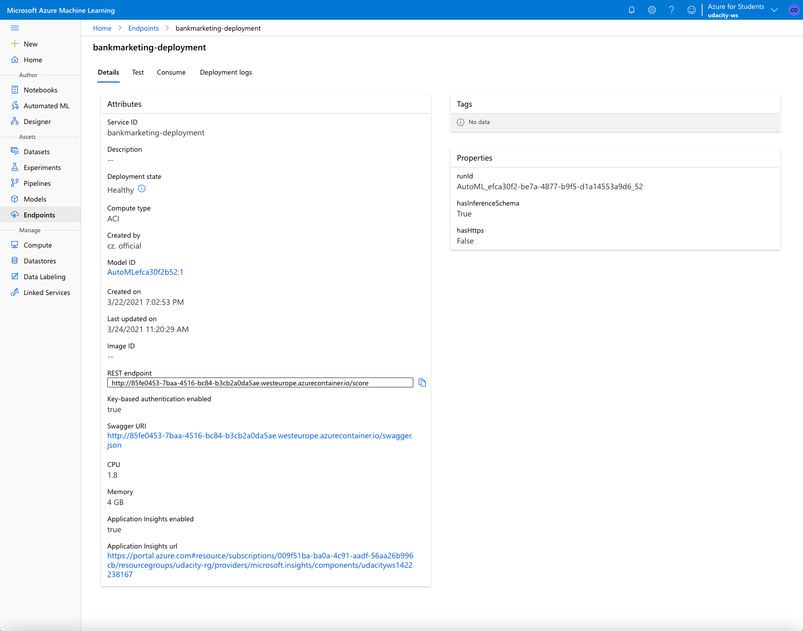\
After enabeling Application Insights via Azure CLI, it can be seen in the details tab of the bankmarketing-deployment endpoint as well, including the actual URL to Application Insigths.

### 5. Swagger documentation
In this step, the deployed model will be consumed by Swagger (to be more precise: a Swagger UI docker container). Swagger is used to build an interactive API documentation by reading a JSON file containing a detailed description of the entire API. The JSON file for this project's best model is downloadable in the details tab of the bankmarketing-deployment endpoint (see also the screenshot above). This refers to the uploaded swagger.sh and serve.py script.

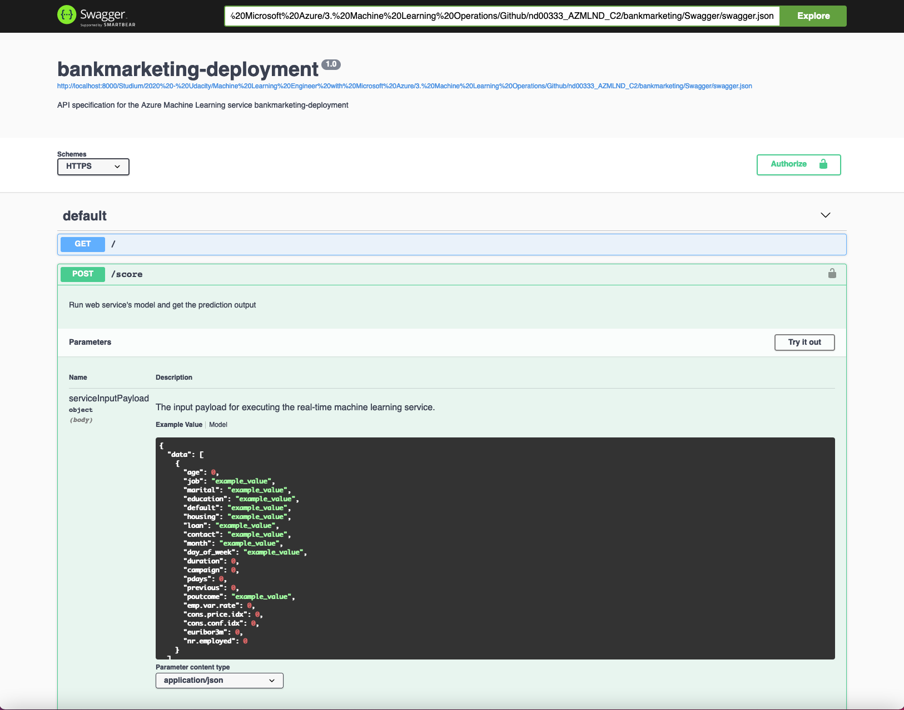\
This screenshot shows that Swagger runs on localhost showing the HTTP API methods and respones for the best model. It shows what GETs and POSTs can be performed on the endpoint.

### 6. Consume model endpoints
Once the model is deployed, the provided endpoint.py script can be used to interact with the trained model by including the specific bankmarketing-deployment endpoint URI and authentication key to the script.

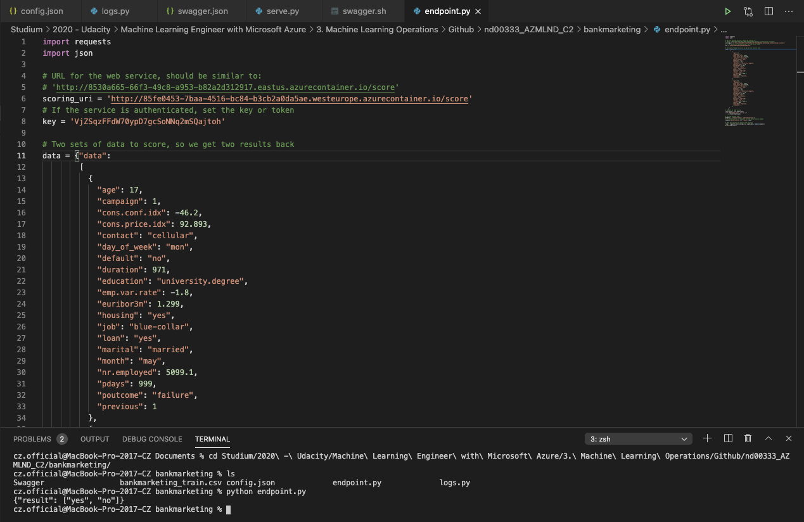\
Once this is done, the python script can be run against the API and the response of the best model endpoint can be seen as an output. In this case: 'yes' and 'no' for two separate data inputs.

### 7. Create and publish a pipeline
For creating, publishing and consuming a pipeline, a provided Jupyter Notebook on AzureML Studio is used. This refers to the uploaded aml-pipelines-with-automated-machine-learning-step.ipynb notebook.

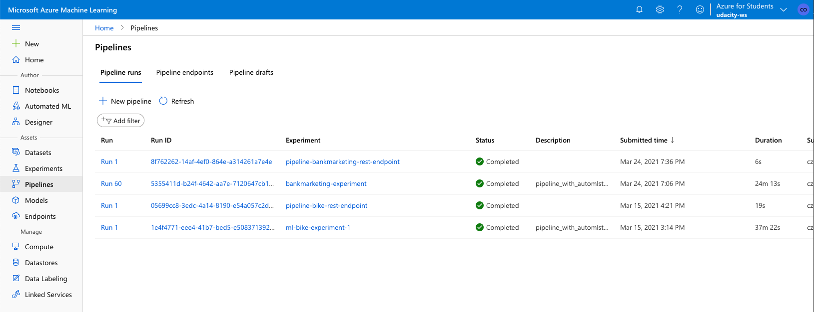\
This screenshot shows that the pipeline was created and the status was set to 'completed'.

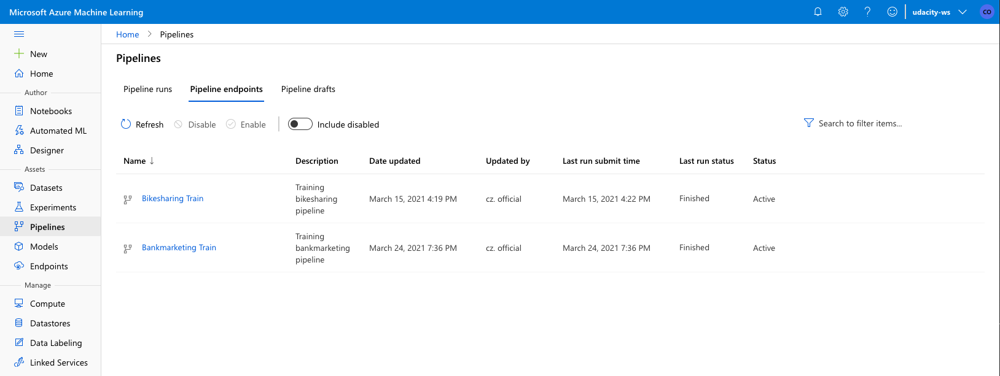\
This screenhot shows the pipeline endpoint in the pipelines section. The AzureML SDK for Python was used to publish the pipeline to a REST endpoint. This will allow one to run the pipeline using a simple REST API call.

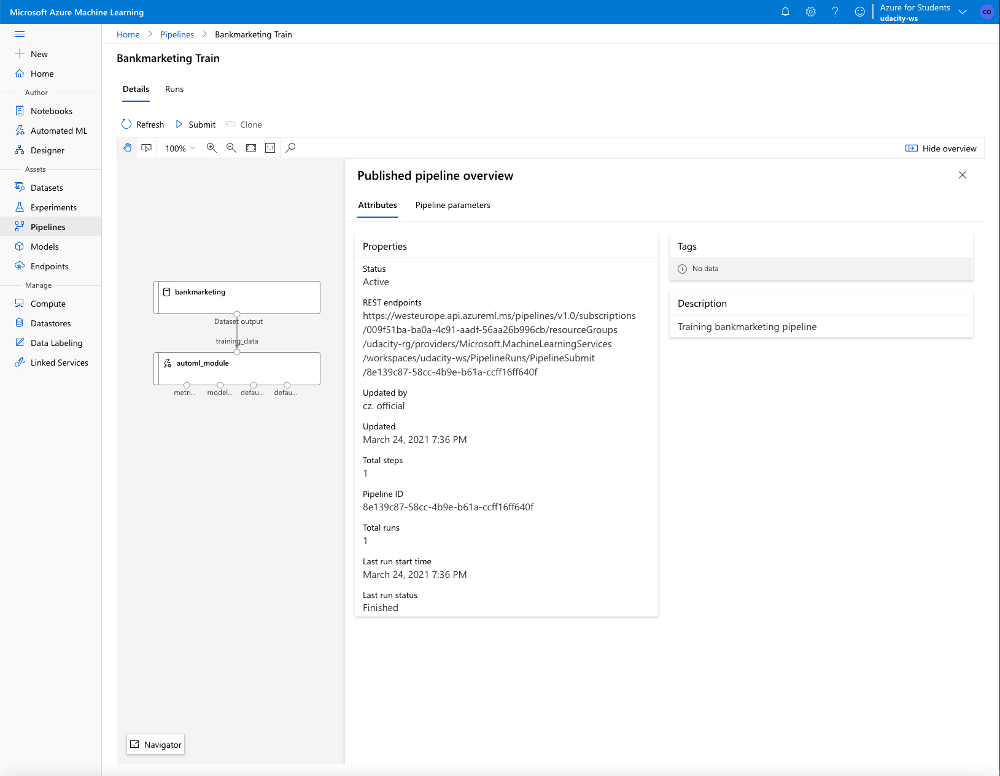\
The published pipeline overview shows the REST endpoint (REST URL), including the confirmation of an 'active' status.

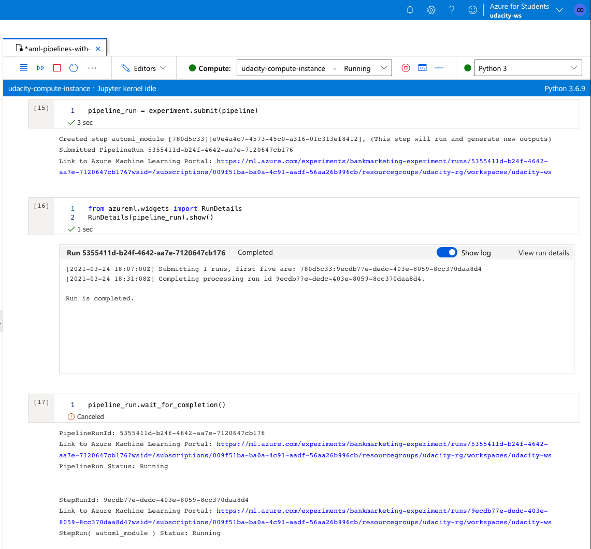\
Jumping to the Jupyter Notebook, the run steps can be seen using the RunDetails widget. In this case, it doesn't show the full capabilities of the RunWidget as the notebook wasn't run in a separate Juyper Notebook editor.

### 8. Documentation
The submission includes this README file that describes the main components of the project and a screencast that shows the entire process of the working ML application.

## Screen Recording
This screen recording shows the entire process of the working ML application, including the following areas:
- Working deplyoed ML model endpoint
- Deployed pipeline
- Available AutoML model
- Successful API requests to the endpoint with a JSON payload

[Here is the link to the screen recording (6 minutes).](https://www.dropbox.com/s/4o3gu8uhmwxfruw/Udacity_ML-Engineer_with_MS-Azure_Project-02_Screen-Recording.mov?dl=0)

## Future Improvements
- Model improvements

Data guardrails are run by AutoML when automatic featurization is enabled. This is a sequence of checks over the input data to ensure high quality data is being used to train models. In this case, imbalanced classes were detected in the dataset by AutoML, which could lead to a falsely perceived positive effect of a model's accuracy because the input data has bias towards one class.

One way of dealing with this imbalance could be using a performance metric that deals better with imbalanced data. For example, the AUC_weighted is a primary metric that calculates the contribution of every class based on the relative number of samples representing that class, hence is more robust against imbalance. Another one would be the F1 score. However, the correct way would be to resample the input data to even the class imbalance, either by up-sampling the smaller classes or down-sampling the larger classes.